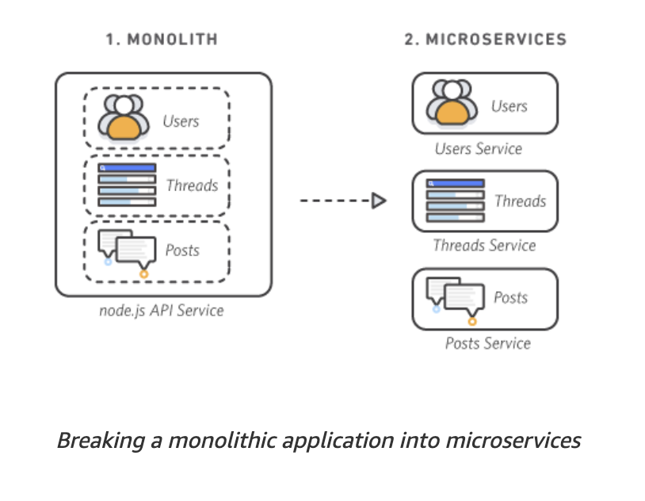

# Assignment 6 Questions

### Ques1. What is microservices?
Ans. Microservices are an architectural and organizational approach to software development where software is 
composed of small independent services that communicate over well-defined APIs. These services are owned by small, 
self-contained teams.

Microservices architectures make applications easier to scale and faster to develop, enabling innovation and 
accelerating time-to-market for new features.

### Ques2. What is monolith architecture?
Ans. Monolithic is an architecture where services are tightly coupled with each other and run as a single service and 
hence difficult to scaled when more demands comes in pictures.

In case of spike in demand, entire architecture needs to be spiked and so features becomes more complex and difficult 
to manage.


### Ques3. Difference between monolith and microservices?
#### Monolithic
Ans. With monolithic architectures, all processes are tightly coupled and run as a single service. This means that if one 
process of the application experiences a spike in demand, the entire architecture must be scaled. Adding or improving a 
monolithic application’s features becomes more complex as the code base grows. This complexity limits experimentation and 
makes it difficult to implement new ideas. Monolithic architectures add risk for application availability because many 
dependent and tightly coupled processes increase the impact of a single process failure.

#### Microservices
With a microservice architecture, an application is built as independent components that run each application process 
as a service. These services communicate via a well-defined interface using lightweight APIs. Services are built for 
business capabilities and each service performs a single function. Because they are independently run, each service can 
be updated, deployed, and scaled to meet demand for specific functions of an application.




### Ques4. Why do we need useEffect hook?
Ans. The motivation behind the introduction of useEffect Hook is to eliminate the side-effects of using class-based 
components. For example, tasks like updating the DOM, fetching data from API end-points, setting up subscriptions or 
timers, etc can be lead to unwarranted side-effects.


### Ques5. What is optional chaining?
Ans. The optional chaining (?.) operator accesses an object's property or calls a function. If the object accessed or f
unction called is undefined or null, it returns undefined instead of throwing an error.


### Ques6. What is Shimmer UI?
Ans. A shimmer UI resembles the page's actual UI, so users will understand how quickly the web or mobile app will load 
even before the content has shown up. It gives people an idea of what's about to come and what's happening 
(it's currently loading) when a page full of content/data takes more than 3 - 5 seconds to load.


### Ques7. Difference between Js expression and Js statement?
Ans. Expressions produce a value, and that value will be passed into the function. Statements don't produce a value, 
and so they can't be used as function arguments

expression
```
5*10 -> 50
```

statement
```js
let a = "hello"
```


### Ques7. What is conditional rendering, explain with a code example?
Ans. Conditional rendering is a term to describe the ability to render different user interface (UI) markup 
if a condition is true or false.

For example, If we have load any api data in ui then it takes time to fetch api data, till then we can show loader

```jsx
import Loader from "./Loader";
import Body from "./Body";

{
    isLoading ? <Loader/> : <Body />
}
```

### Ques8. What is CORS?
Ans. Cross-Origin Resource Sharing (CORS) is an HTTP-header based mechanism that allows a server to indicate any 
origins (domain, scheme, or port) other than its own from which a browser should permit loading resources. CORS also 
relies on a mechanism by which browsers make a "preflight" request to the server hosting the cross-origin resource, 
in order to check that the server will permit the actual request. In that preflight, the browser sends headers that 
indicate the HTTP method and headers that will be used in the actual request.


An example of a cross-origin request: the front-end JavaScript code served from https://domain-a.com uses 
XMLHttpRequest to make a request for https://domain-b.com/data.json.

For security reasons, browsers restrict cross-origin HTTP requests initiated from scripts. For example, XMLHttpRequest 
and the Fetch API follow the same-origin policy. This means that a web application using those APIs can only request 
resources from the same origin the application was loaded from unless the response from other origins includes the 
right CORS headers.

//TODO: Watch Akshay saini video for CORS


### Ques9. What is async and await?
Ans. Async functions can contain zero or more await expressions. Await expressions make promise-returning functions 
behave as though they're synchronous by suspending execution until the returned promise is fulfilled or rejected. 
The resolved value of the promise is treated as the return value of the await expression. Use of async and await 
enables the use of ordinary try / catch blocks around asynchronous code.


### Ques10. What is the use of const json = await data.json(); ?
Ans. The json() method of the Response interface takes a Response stream and reads it to completion. It returns a 
promise which resolves with the result of parsing the body text as JSON.

Note that despite the method being named json(), the result is not JSON but is instead the result of taking JSON as 
input and parsing it to produce a JavaScript object.

